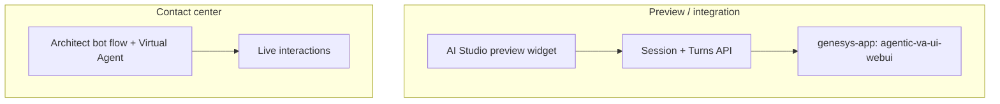

# Genesys AI Studio — AVA Session API Guide

Reference for future sessions. Consolidates exploration of **Agentic Virtual Agents (AVA)** via the internal **session + turns** API, **AI Studio preview**, and tooling in this repo.

**Last updated:** 2026-06-04  
**Environment:** `mypurecloud.com`  
**Primary test agent:** Simple front door — `1f7dd771-c326-44bf-a12e-eff153fd2da1`

---

## Quick start

```bash
cd ~/Personal/genesys-api-demo

# Auth (once): writes ~/.gc/config.toml profile "default"
./setup_auth.sh

# Studio-aligned interactive chat (recommended)
./ava_interactive.sh end
./ava_interactive.sh start-studio
./ava_interactive.sh noop
./ava_interactive.sh say schedule    # expect SCHEDULE
./ava_interactive.sh end

# Simple GET (e.g. guides)
./run_api.sh /api/v2/guides
```

**API Explorer:** [apicentral.genesys.cloud/api-explorer-standalone](https://apicentral.genesys.cloud/api-explorer-standalone)  
**gc CLI:** `gc -p default guides list --outputformat json` (profile name must match `~/.gc/config.toml`)

---

## Executive summary

| Topic | Finding |
|-------|---------|
| **Studio preview vs session API** | Same URLs; Studio adds **`genesys-app: agentic-va-ui-webui`** and specific body shape. Without that header, turns return a generic greeting instead of `RESEARCH` / `SCHEDULE` / `ACTION`. |
| **Flow deployment** | **Not required** for session API. Simple front door has **no** Architect consumer; sessions still return 201. |
| **Auth** | Browser preview uses **apps.mypurecloud.com cookies** (no Bearer in HAR). Scripts use **OAuth client credentials**; works with Studio headers + body. |
| **Read-back** | No GET session/turn history. Log your POST bodies; use **`ININ-Correlation-Id`** for Support only. |
| **Copilot agents API** | `GET .../copilots/agents` → **501** `feature.toggle.not.implemented` on prod (Internal). |
| **AVA list/get** | `GET .../virtualagents`, version GET/PATCH, publish jobs — work with client credentials. |

---

## The one fix that mattered (HAR analysis)

From `artifacts/` HAR capture (`apps.mypurecloud.com.har`). Full detail: [docs/har-ava-analysis.md](docs/har-ava-analysis.md).

### Required for classification responses

1. **Header**
   ```http
   genesys-app: agentic-va-ui-webui
   ```

2. **Turn sequence**
   - Create session → **NoOp** turn (greeting) → **UserInput** turns (classification)

3. **UserInput body** (match Studio exactly)
   ```json
   {
     "previousTurn": { "id": "<prior-turn-uuid>" },
     "version": "5.0",
     "inputEvent": {
       "type": "UserInput",
       "mode": "Text",
       "alternatives": [{
         "transcript": { "confidence": 1, "text": "schedule" }
       }]
     }
   }
   ```
   Do **not** rely on top-level `alternatives[].text` only; include **`transcript.confidence`**.

### Session create (Studio)

```json
{
  "version": "5.0",
  "channel": {
    "name": "Messaging",
    "inputModes": ["Text"],
    "outputModes": ["Text"],
    "userAgent": { "name": "GenesysWebWidget" }
  },
  "inputData": {},
  "language": "en-us"
}
```

### Expected turn responses

| Turn | Input | `prompts.text.segments[0].text` |
|------|--------|----------------------------------|
| 1 | NoOp | Hello! How can I assist you today? |
| 2 | schedule | **SCHEDULE** |
| 3 | research | **RESEARCH** |

---

## API reference (session runtime)

Internal visibility · scope `agentic-virtualagents-internal` · permissions `agentic:virtualAgentSession:add`, `agentic:virtualAgentSessionTurn:add`.

| Method | Path |
|--------|------|
| POST | `/api/v2/apps/agentic/virtualagents/{agentId}/sessions` |
| POST | `/api/v2/apps/agentic/virtualagents/{virtualAgentId}/sessions/{sessionId}/turns` |

**Not available:** GET session, GET turns, DELETE version, session trace API.

Extended field tables and curl examples: [docs/ava-session-api-doc.md](docs/ava-session-api-doc.md).

---

## Simple front door agent

| Field | Value |
|-------|--------|
| ID | `1f7dd771-c326-44bf-a12e-eff153fd2da1` |
| Role | Receptionist — classify as research, schedule, or actions |
| Instructions | Output only `RESEARCH`, `SCHEDULE`, or `ACTION` |
| Versions | Multiple ProductionReady (1.0–5.0+) after experiments; **use `5.0`** to align with Studio HAR |
| Architect flow | **Not deployed** (dependency tracking `total: 0`) |

**Definition highlights (v1.0 / v2.0):** `comfortStatement.enabled` was `true` on v1.0; disabled on v2.0. Patching **ProductionReady** versions in-place via API returns 400 — create new version + publish job.

---

## Authentication

| Method | Use |
|--------|-----|
| **Client credentials** | `~/.gc/config.toml` profile `default`, `setup_auth.sh`, `run_api.sh`, `ava_interactive.sh` |
| **Browser / Studio** | Cookie session on `apps.mypurecloud.com`; HAR had no Bearer on AVA calls |
| **gc CLI** | `gc -p <profile> ...` — profile section name must exist (`[default]` not `[onboarding]` unless you pass `-p onboarding`) |

**Never paste Bearer tokens in chat.** Rotate if exposed.

Verify credentials:

```bash
gc -p default guides list --outputformat json
./run_api.sh /api/v2/guides
```

---

## What we tried that failed (and why)

| Attempt | Result | Why |
|---------|--------|-----|
| Session API v2.0, `Unknown` userAgent, UserInput only | Greeting every turn | Missing `genesys-app`, NoOp, `previousTurn`, transcript shape |
| Client credentials + correct bodies, no header | Greeting | Missing **`genesys-app: agentic-va-ui-webui`** |
| User Bearer token (stale paste) | Greeting | Token expired or still missing header |
| PATCH v1.0 disable comfort | 400 | Cannot PATCH ProductionReady version |
| DELETE versions 3.0/4.0 | 405 / promoted instead | No delete API; jobs promoted drafts |
| `GET .../copilots/agents` | 501 | Feature toggle off on prod |
| Match Studio without `previousTurn` | Greeting on turn 2 | HAR sends `previousTurn` on UserInput |

---

## Runtime and logging

- **Studio preview** and **session API** differ until headers/bodies match; then client creds reproduce `SCHEDULE`/`RESEARCH`.
- Turn response has **no input echo** — log outbound POST JSON yourself.
- **`ININ-Correlation-Id`** on responses — for Genesys Support, not customer trace download.
- Optional: `nextAction.outputData` for structured output (often empty for this agent).

Details: [docs/ava-runtime-logging.md](docs/ava-runtime-logging.md).

---

## Production vs preview paths



- **Session API:** integration / preview-style testing (rate limit namespace `user.preview.session.turn.requests.per.minute` observed historically).
- **Architect + VA:** documented production path; requires flow wiring (Simple front door not wired today).

Deployment check: [docs/ava-session-deployment-check.md](docs/ava-session-deployment-check.md).

---

## Repo layout

```
genesys-api-demo/
├── AVA-SESSION-GUIDE.md      ← this file (start here)
├── README.md                   ← short entry + links
├── ava_interactive.sh          ← Studio chat (start-studio / noop / say / end)
├── run_api.sh                  ← generic curl runner (profile from ~/.gc)
├── setup_auth.sh               ← interactive ~/.gc/config.toml setup
├── call_ai_studio_api.py       ← Python alternative to run_api.sh
├── .env.example
├── .gitignore                  ← ignores .env, .ava-session.json
├── docs/                       ← detailed write-ups
│   ├── ava-session-api-doc.md
│   ├── ava-runtime-logging.md
│   ├── ava-session-deployment-check.md
│   └── har-ava-analysis.md
└── artifacts/                  ← JSON captures (HAR, debug, reports)
    ├── har-ava-analysis.json
    ├── simple-front-door-ava-debug.json
    ├── simple-front-door-ava-report.json
    ├── studio-preview-replication.json
    └── ...
```

### Artifact index

| File | Contents |
|------|----------|
| `har-ava-analysis.json` | Parsed HAR entries (redacted auth) |
| `studio-preview-turn-responses-reference.json` | Browser turn 1/2 JSON you captured |
| `studio-preview-replication.json` | API replication attempts |
| `simple-front-door-ava-debug.json` | 28 experiments (channels, NoOp, agents) |
| `simple-front-door-ava-report.json` | GET agent + version 1.0 definition |
| `simple-front-door-ava-session-test.json` | Early session/turn probes |
| `simple-front-door-ava-patch-log.json` | PATCH/publish v2.0 attempts |
| `simple-front-door-ava-cleanup.json` | Version cleanup attempts |
| `simple-front-door-ava-trace-refs.json` | Correlation IDs for Support |

---

## Interactive chat in Cursor

Agent runs `./ava_interactive.sh` via shell. State: `.ava-session.json` (gitignored).

| Command | Action |
|---------|--------|
| `start-studio` | Session v5.0 + GenesysWebWidget + studio headers |
| `noop` | NoOp turn (greeting) |
| `say <text>` | UserInput; auto-NoOp if first message |
| `end` | Clear session |
| `status` | Show state file |

User messages in chat → agent calls `say` → paste AVA reply.

---

## Support escalation template

```
Agent: Simple front door (1f7dd771-c326-44bf-a12e-eff153fd2da1)
Version: 5.0, channel Messaging
Issue: Studio preview returns SCHEDULE/RESEARCH; session API without genesys-app header returns only comfort greeting.
ININ-Correlation-Id: <from response header>
SessionId: <uuid>
TurnId: <uuid>
Request body: <inputEvent JSON>
```

---

## Related AI Studio APIs (same org)

| Area | Base path | Notes |
|------|-----------|--------|
| Virtual Agents CRUD | `/api/v2/apps/agentic/virtualagents` | List/create/publish |
| Copilot | `/api/v2/apps/agentic/copilots/*` | 501 on agents list (prod); separate product |
| Guides | `/api/v2/guides` | Public; good auth smoke test |

---

## Open questions / next steps

- [ ] Wire Simple front door into Architect flow and test simulator/replay
- [ ] Confirm whether `genesys-app` is documented publicly or internal-only
- [ ] Clean extra ProductionReady versions (3.0–5.0) in AI Studio UI if needed
- [ ] Document `ACTION` intent with same HAR-matched invocation
- [ ] Copilot session API (`GET .../copilots/sessions/.../messages`) if Copilot work resumes

---

## Changelog (exploration)

| Date | Learning |
|------|----------|
| 2026-06-03 | Session API works; comfort greeting; copilots 501; guides 200 |
| 2026-06-03 | Studio preview returns SCHEDULE; API did not — auth/runtime hypothesis |
| 2026-06-04 | HAR: `genesys-app` + `previousTurn` + transcript-only = SCHEDULE/RESEARCH reproduced |
| 2026-06-04 | `ava_interactive.sh start-studio` updated; interactive chat verified |
