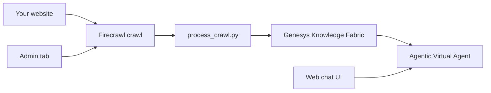

# AVA FAQ Bot

Self-service **FAQ chatbot** for [Genesys Cloud Agentic Virtual Agents (AVA)](https://help.mypurecloud.com/articles/agentic-virtual-agents-overview/): crawl a website, ingest into **Knowledge Fabric**, and answer questions via a custom web UI or the Session API.

**Live example:** [ava-faq-chat-production.up.railway.app](https://ava-faq-chat-production.up.railway.app)

## What you get



| Component | Description |
|-----------|-------------|
| **Ingest pipeline** | `crawl-shallow` → `process_crawl.py` → `sync_faq_to_genesys.py` |
| **Knowledge wiring** | `setup_knowledge_config.py` connects AVA to a Knowledge setting |
| **Web app** | FastAPI chat UI + **Admin** tab (manual ingest, content browser) |
| **Railway deploy** | Docker + `/data` volume for persistent crawls |
| **CLI tools** | `ava_interactive.sh`, Firecrawl demo, generic API runner |

## Quick start

**New to this repo?** → **[GETTING_STARTED.md](GETTING_STARTED.md)** (step-by-step checklist).

```bash
git clone https://github.com/ecalvesbert/AVA_faq_bot.git
cd AVA_faq_bot
pip install -r requirements.txt
./setup_auth.sh
cp .env.railway.example .env   # fill credentials + AVA_AGENT_ID
./run_web.sh
```

Open http://localhost:8080 — use **Admin** to run ingest manually.

## Pipeline (CLI)

```bash
python3 firecrawl_demo.py crawl-shallow "https://www.example.com/" \
  --output-dir artifacts/crawls/www.example.com
python3 process_crawl.py --input-dir artifacts/crawls/www.example.com
python3 sync_faq_to_genesys.py --input-dir artifacts/crawls/www.example.com/processed
python3 setup_knowledge_config.py --agent-id <id> --version <ver> --publish
```

## Deploy to Railway

```bash
export RAILWAY_API_TOKEN=...
export RAILWAY_WORKSPACE="Your Workspace"
export USE_GC_PROFILE=1
./deploy_railway.sh
```

**CI/CD:** push to `main` auto-deploys via GitHub Actions once you add a `RAILWAY_TOKEN` secret. See [docs/cicd-railway.md](docs/cicd-railway.md).

Ingest is **manual only** — use the **Admin** tab → **Start ingest**. See [GETTING_STARTED.md](GETTING_STARTED.md) §5.

Push local crawls to a deployed app:

```bash
export PIPELINE_API_KEY=...
python3 sync_local_to_railway.py
```

## Project layout

| Path | Purpose |
|------|---------|
| `app/` | FastAPI web service (chat + admin + content API) |
| `firecrawl_demo.py` | Scrape / search / shallow crawl |
| `process_crawl.py` | Clean markdown for Knowledge Fabric |
| `sync_faq_to_genesys.py` | File Connector upload |
| `setup_knowledge_config.py` | Knowledge setting + AVA tool |
| `sync_local_to_railway.py` | Push local `artifacts/` to Railway |
| `deploy_railway.sh` | One-shot Railway deploy |
| `ava_interactive.sh` | CLI AVA chat (Studio-aligned) |
| `GETTING_STARTED.md` | Onboarding for new sessions |
| `AVA-SESSION-GUIDE.md` | Session API reference |
| `docs/` | HAR analysis, deployment notes |
| `artifacts/` | Runtime data (gitignored; see `artifacts/README.md`) |

## Environment variables

| Variable | Required | Purpose |
|----------|----------|---------|
| `GENESYS_CLIENT_ID` / `SECRET` | Yes | OAuth (or `~/.gc/config.toml`) |
| `AVA_AGENT_ID` / `AVA_VERSION` | Yes | Target AVA |
| `AVA_STUDIO_MODE` | Yes (`1`) | Correct turn chaining for web chat |
| `PIPELINE_API_KEY` | Prod | Protect Admin + ingest APIs |
| `FIRECRAWL_API_KEY` | Recommended | Crawl on Railway |
| `DATA_DIR` | `artifacts` local, `/data` Railway | Content store |

Full list: [`.env.railway.example`](.env.railway.example)

## Prerequisites

- Genesys OAuth with `agentic-virtualagents-internal` and Knowledge scopes  
- Published AVA with **KnowledgeSetting** tool  
- Python 3.10+ (3.12 on Railway)

## License

MIT — use and adapt for your org’s FAQ use cases.
